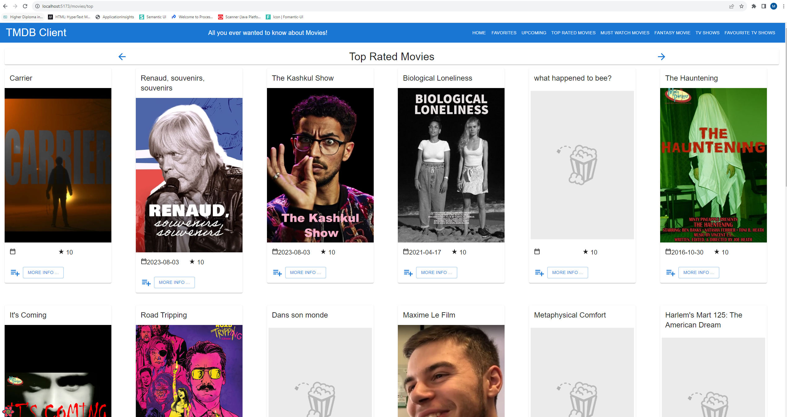
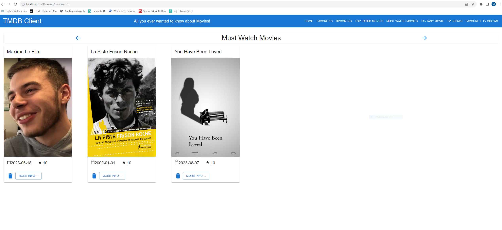
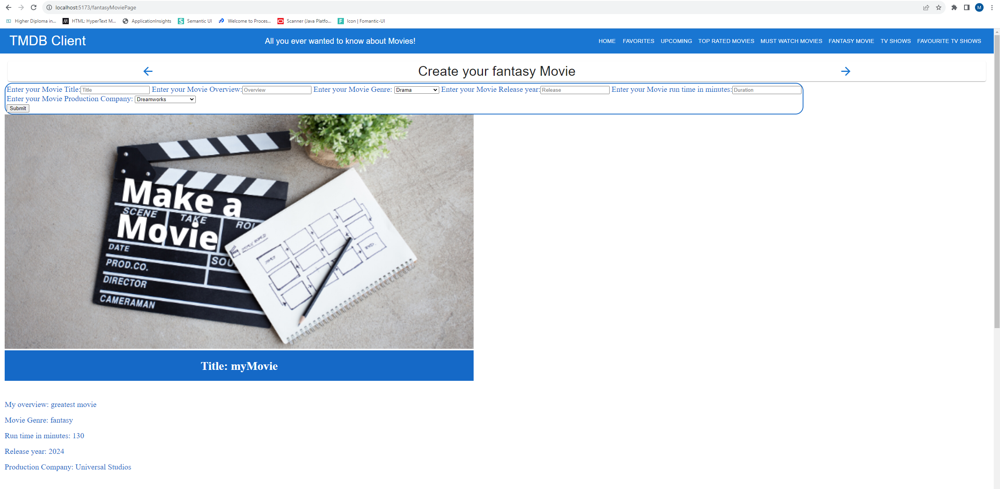
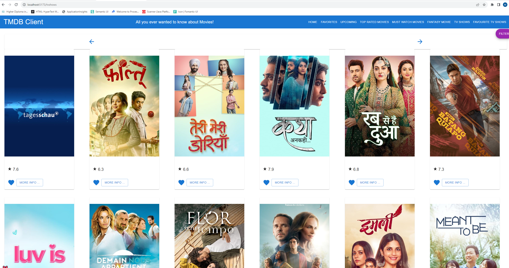
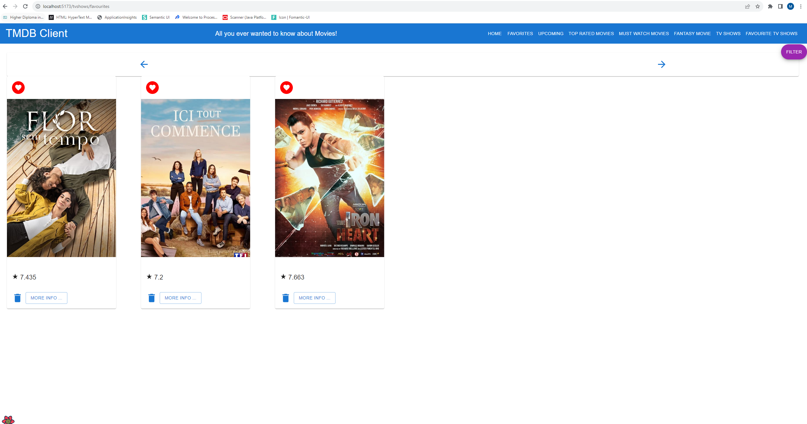

# Full Stack Development 2 - Assignment.

__Name:__ Mairead Holton

## Features.

[A bullet-point list of the features developed for the React SPA app (only new/modified ones for the Movies app),]

+ Top rated Movies Page.
+ Must watch Movies Page.
+ Fantasy Movie page.
+ TV Show list page. 
+ TV Show Favourites page.

## Feature Design.

[ For each feature listed above, show a screenshot(s) of its UI layout (use appropriate magnification for accessibility). Include a caption with each image.]

#### Top rated Movies.

> Lists Top rated movies from the vote average endpoint of TMDB, sorting movies from highest to lowest rated.

#### Must watch Movies Page.

> Allows the user to create a list of must watch movies from the top rated and upcoming movies pages.

#### Fantasy Movie Page.

> Allows the user to create a list of fantasy movies, the user can enter a title, overview, run time, production company, genre and release date for their fantasy movie using a combination of dropdown and text entry boxes.

#### TV Show List Page.

> Displays to the user a list of TV shows with posters, vote average and an option to add to favourites.

#### TV Show Favourites Page.

> Displays the users saved favourite TV shows.

## Storybook.

[Include a screenshot(s) from the Storybook UI and highlight the stories for new components developed.]

e.g.

![][image5]

## Authentication. (if relevant)

#### Protected routes 

[List all the routes in your app and highlight those that are protected/private (require authentication).]

e.g.

+ /movies - List of 20  movies from the Discover endpoint,
+ /movies/{movie_id} - Detailed information on a specific movie.
+ /reviews/{review_id} (Protected) - The full text of a movie review.
+ /movie/{movie_id}/similar - A list of similar movies. 
+ /person/{person_id} (Protected) - A specific actor's bio.
+ etc
+ etc

#### Protected functionality. (if relevant)

[ Briefly state any app functionality that requires authentication, e.g. only authenticated users can tag a movie as a 'favourite'.]

#### Supabase (if relevant)

[Include a screenshot(s) from your Supabase account that verifies its use for this app. ]

## Deployment (if relevant).

[Specify the URL of your deployed app and include a screenshot(s) from your deployment platform account (e.g. Vercal) that verifies its use for this app. Set up a registered user for your app and specify their credentials.

Username: test1 ; Password: pass1
]

## Persistence (if relevant).

[If you are persisting data to the Supabase backend (e.g. favourite movies, fantasy movie), include screenshots with appropriate captions to verify this aspect. ]

## Additional Information.

[ Briefly explain any other aspects of your app's design or implementation that is non-standard and worthy of mention.]

[image1]: ./images/image1.png
[image2]: ./images/image2.png
[image3]: ./images/image3.png
[image4]: ./images/image4.png
[image5]: ./images/image5.png